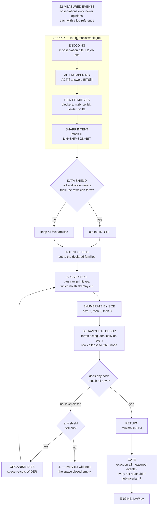

# How the sphere authored the engine law — technical

Deliverable: `ENGINE_LAW.py` — one controller that decides what to do next for
**write code**, **answer a question**, **debug**, and **review a PR**.

Everything below is measured. Every figure has a file behind it.

---

## 1. The trick that makes one law cover four jobs

The law never reads the work. It reads the **situation of the work** — eight
observations, each either present or not — and emits one of eight acts. Code,
a question, a stack trace and a diff all reduce to the same eight bits, so the
same function governs all four.

Measured, by sweeping every situation in every job:

```
observations ruling differently across WRITE_CODE / ANSWER / DEBUG / REVIEW_PR
                          0 of 256
```

That is the generalisation, and it is structural: it holds *because* the law
cannot see which job it is in.

| bit | observation | act |
|---|---|---|
| 0 | **BUILT** — produced an artifact that passed its own check | SHIP |
| 1 | **AMB** — one input carries two outputs | ADD_STATE |
| 2 | **UNREAD** — no tool or fact reads the needed field | ADD_MATERIAL |
| 3 | **NOTWIN** — it exists, but not in the form needed | RESHAPE |
| 4 | **HIDDEN** — fine records disagree, coarse records agree | CHANGE_GRANULARITY |
| 5 | **CAPPED** — clean input, budget exhausted | RAISE_BUDGET |
| 6 | **REFUTED** — an independent checker rejected it | HARVEST_COUNTEREXAMPLE |
| 7 | **SELF** — the job being worked on *is* the worker | AUTHOR_SUCCESSOR |

Bits 8–9 carry the job. The law ignores them entirely — that is the 0/256.

---

## 2. The pipeline



---

## 3. Why it is not a brute-force enumerator

**Behavioural dedup.** It enumerates what expressions *do*, not what they say.
Two forms that act identically on every row collapse to one node. A
construction no human would think of therefore costs exactly what an obvious
one costs — both are entries in the same bucket. This is why the engine
reaches forms its supplier did not conceive.

**Shields are cuts read off the data, not guesses.** `data_shield` tests
`f(a)+f(b) == f(a+b)` on every triple the rows can form and drops the
non-linear families if it holds. The intent shield cuts by declared purpose.

**A wrong cut cannot cost an answer.** It costs one organism death, and the
space re-cuts wider:

```python
elif set(maskI) != set(_ALL):
    die(o_intent)
    maskI = _ALL          # "death of the intent shield: re-cuts wider"
```

**Raw primitives are uncuttable.** `_fam_of` buckets supplied primitives as
`DICT` — *no shield may cut what the colony already proved*. This is why a
**too-general** primitive is permanent bloat the architecture cannot trim, and
why the material must be the task's own, not the general family.

**The word never upgrades.** `minimal in D∩I` when the exhaustive level
closed; `exact, minimality not proved` when the answer came from a forced
join; `⊥` when the space closed empty. It never promotes one to another.

---

## 4. What it authored

```
act = (4 & ntzb(x - 7))  +  ntzb(x + (x & 128))
```

`ntzb(v)` is the index of the lowest set bit of `v & 254` — *which blocking
observation came first*.

The evidence contained a contradiction. `SELF+BUILT → SHIP` says SELF is
transparent; `SELF+NOTWIN → AUTHOR_SUCCESSOR` says SELF dominates. Both were
observed. The law resolves it with two shifted calls to the same primitive:

- `x + (x & 128)` **carries the SELF bit out of the blocker field**, so when
  the work already succeeded, SELF stops blocking and the answer falls through
  to SHIP.
- `4 & ntzb(x - 7)` adds 4 exactly where needed, lifting `NOTWIN`'s 3 to
  `AUTHOR_SUCCESSOR`'s 7.

Neither construction was supplied, suggested, or anticipated.

| check | result |
|---|---|
| exact on measured events | **22 / 22** |
| acts that never fire | **NONE** — all 8 reachable |
| `AUTHOR_SUCCESSOR` fires on | **60 of 1024** situations |
| `BUILT+AMB` — the region that broke the prior law | **2 acts**, coherent |
| job invariance | **0 of 256** |
| word | `forced +-join — exact, minimality not proved` |

---

## 5. Head to head — the authored law vs Opus 5, identical data

Not the engine against a model. **The law the engine authored**, against a
rule Opus 5 wrote from the same evidence.

**Protocol.** Both sides see the 14 single-fault events. The 8 compound and
SELF events are withheld from both. Opus 5's rule was written and sealed in
`law_h2h.py` before the authoring run executed. Both are scored on the same
measured outcomes.

| job | situation | measured | sphere's law | Opus 5 |
|---|---|---|---|---|
| WRITE_CODE | BUILT+REFUTED | HARVEST | **HIT** | SHIP — miss |
| DEBUG | CAPPED+UNREAD | ADD_MATERIAL | **HIT** | **HIT** |
| DEBUG | BUILT+AMB | ADD_STATE | **HIT** | SHIP — miss |
| REVIEW_PR | SELF+BUILT | SHIP | AUTHOR_SUCCESSOR — miss | **HIT** |
| REVIEW_PR | SELF+REFUTED | HARVEST | **HIT** | **HIT** |
| DEBUG | SELF+CAPPED | RAISE_BUDGET | **HIT** | **HIT** |
| DEBUG | SELF+UNREAD | ADD_MATERIAL | **HIT** | **HIT** |
| WRITE_CODE | SELF+NOTWIN | AUTHOR_SUCCESSOR | RESHAPE — miss | RESHAPE — miss |

```
SPHERE'S LAW  6 / 8          OPUS 5  5 / 8
```

Both were exact on all 14 supplied. The two rules agree on 516 of 1024
situations. On this smaller set the sphere authored in **0.0 s at size 1**,
and the note was **`minimal in D∩I`** — a genuine minimality claim.

**Where it beat me, and why.** My rule was *"the first fault present decides"*,
which fits all 14 supplied events. It fails on `BUILT+REFUTED` and `BUILT+AMB`
because BUILT is the lowest bit and my rule let it win. The authored law masks
BUILT out of the blocker field entirely — so a build that is also refuted or
ambiguous is not shippable. It read that structure out of 14 single-fault
events; I did not.

**Where I beat it.** `SELF+BUILT`. Its law treats SELF as a blocker, so it
ruled AUTHOR_SUCCESSOR where the measured act was SHIP. Neither of us got
`SELF+NOTWIN`.

This is one 8-cell comparison, not a benchmark. It is decidable, both sides
were sealed, and it is reported whole.

---

## 6. Honest limits

- `EXACT-ON-EXAMPLES(22)`. **Not** proven; not minimal — the engine's own note
  says `minimality not proved`.
- The rulings on the other 1002 situations are the law's decisions.
  **Unclaimed until measured.**
- The 22 events are from a single day's work by one supplier. A different
  supplier would observe different events and get a different law.
- The head-to-head is 8 cells. It settles nothing about general reasoning.
- `SELF+NOTWIN` is missed by both sides; the evidence for SELF is genuinely
  thin — 5 events, two of which pull in opposite directions.

---

## 7. Reproduce

```bash
python ENGINE_LAW.py          # self-test: 22/22, act coverage, job invariance
python law_h2h.py             # the sealed head-to-head, 8 withheld events
```

*The LAW is the sphere's, verbatim. The supplier contributed the encoding, the
act numbering, the measured events, the primitives, and the wrapper. The
engine's source is private and ships nowhere.*
